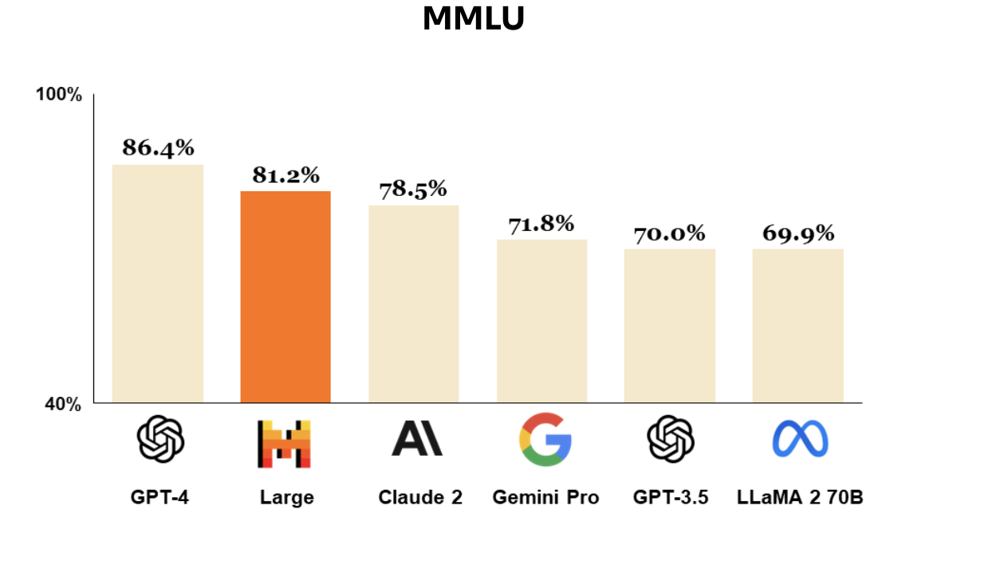
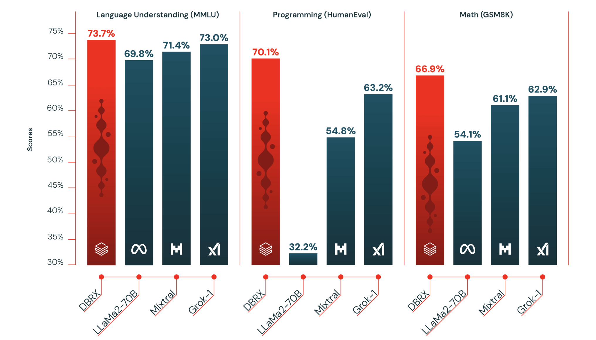
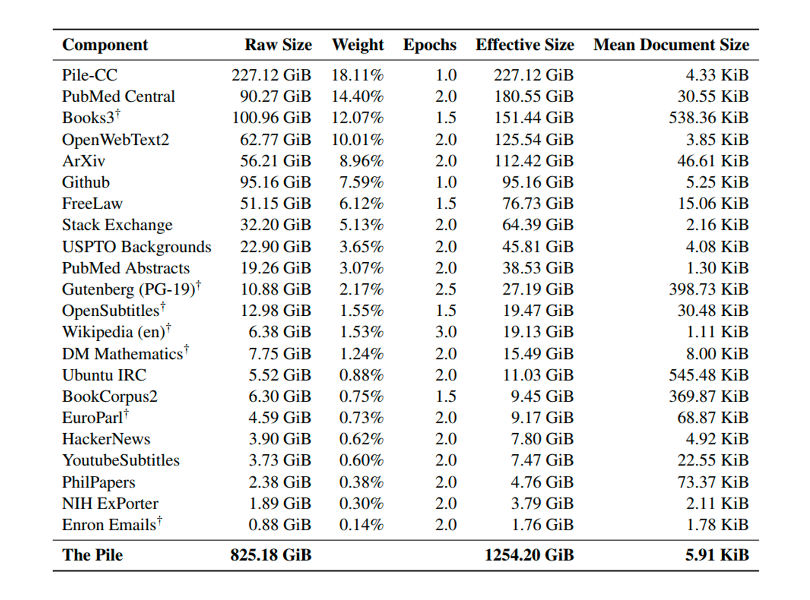

# finetuning-llm-mistral

## LLM-LeaderBoard

https://huggingface.co/spaces/HuggingFaceH4/open_llm_leaderboard

https://huggingface.co/spaces/optimum/llm-perf-leaderboard

https://deci.ai/blog/list-of-large-language-models-in-open-source/

## Dataset for Training LLM

[Dataset Study](https://arxiv.org/pdf/2402.18041.pdf)

[Pile Dataset](https://pile.eleuther.ai/)

[RedPajama](https://github.com/togethercomputer/RedPajama-Data)

[GPT3](https://arxiv.org/pdf/2005.14165.pdf)

[LLaMa](https://arxiv.org/abs/2302.13971)

## Dataset for Fine Tuning

https://huggingface.co/datasets/argilla/databricks-dolly-15k-curated-en

https://huggingface.co/datasets/HuggingFaceH4/ultrachat_200kLinks

https://huggingface.co/datasets/Fredithefish/openassistant-guanaco-unfilteredLinks

https://huggingface.co/datasets/tatsu-lab/alpacaLinks

https://huggingface.co/datasets/Open-Orca/OpenOrcaLinks

https://huggingface.co/datasets/c-s-ale/alpaca-gpt4-dataLinks

others: https://huggingface.co/datasets?other=llm

